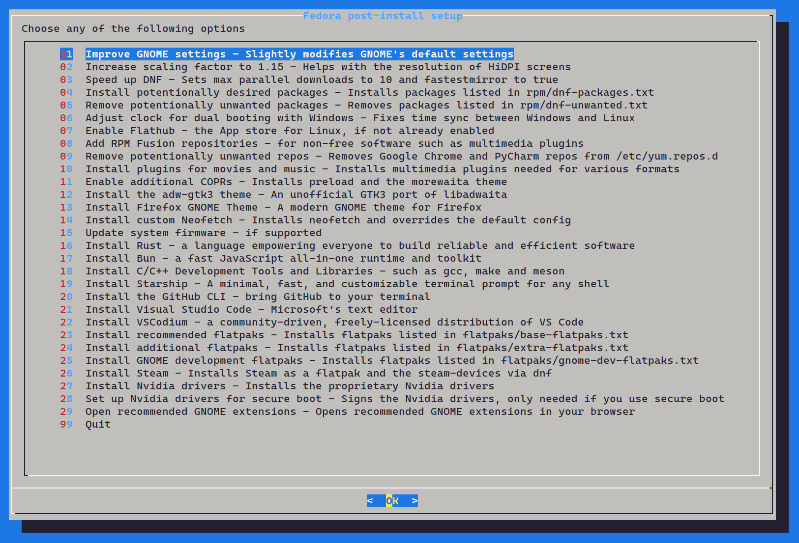

# Fedora Post-install Setup



This script represents the steps I usually take to configure my Fedora installs. Most these changes shouldn't be unconventional.\
Credit to [@smittix](https://github.com/smittix)'s [fedorable](https://github.com/smittix/fedorable) script for inspiring me to rewrite this using `dialog`.


> [!CAUTION]
> ***Most of the configuration is tailored to my personal liking. Double check the content of all the files in the repo before running this on any system.***


#### You can choose to execute any combination of the following
- Add [Flathub](https://flathub.org/) (if not added)
- Add the [RPM Fusion](https://docs.fedoraproject.org/en-US/quick-docs/rpmfusion-setup/) repositories
- Remove Google Chrome and PyCharm repos from `/etc/yum.repos.d`
- Install plugins for movies and music ([as per the Fedora documentation](https://docs.fedoraproject.org/en-US/quick-docs/installing-plugins-for-playing-movies-and-music/))
- Improve GNOME's default settings (check [gnome/gsettings.sh](gnome/gsettings.sh) for details)
- Set `fastestmirror` to DNF config
- Remove unneeded packages (check [rpm/dnf-unwanted.txt](rpm/dnf-unwanted.txt) for details, edit this file to your liking)
- Adjust system clock for dual booting with Windows
- Enable additional COPRs (elxreno/preload, dusansimic/themes, dawid/better_fonts)
- Install [adw-gtk3](https://github.com/lassekongo83/adw-gtk3) GTK3 theme
- Install Nvidia drivers
- Install RPM packages (check [rpm/dnf-packages.txt](rpm/dnf-packages.txt) for details, edit this file to your liking)
- Install the [GitHub CLI](https://cli.github.com/)
- Install [Visual Studio Code](https://code.visualstudio.com/)
- Install C Development Tools and Libraries
- Update system firmware
- Install flatpaks (general/GNOME/GNOME Dev, check flatpak folder for the list)
- Install Steam (flatpak) and steam-devices (dnf)
- Open recommended GNOME extensions in browser (check [gnome/gnome-extensions.txt](gnome/gnome-extensions.txt))
- Copy custom neofetch config (slightly modified version of the [Boxes theme](https://github.com/Chick2D/neofetch-themes/blob/main/normal/boxes.conf))
- Install the [Firefox GNOME Theme](https://github.com/rafaelmardojai/firefox-gnome-theme)
- Install [Starship](https://starship.rs/) (You will need to install a [Nerd Font](https://www.nerdfonts.com/font-downloads) manually)
- Install [Bun](https://bun.sh/)
- Install [Rust](https://www.rust-lang.org/)

### Installation script
1. Clone this repo and navigate to directory:

	```sh
	git clone https://github.com/jpkhawam/fedora-setup && cd fedora-setup
	```

2. Run installation script

	```sh
	bash fedora-setup.sh
	```

3. Reboot

	```sh
	reboot
	```
